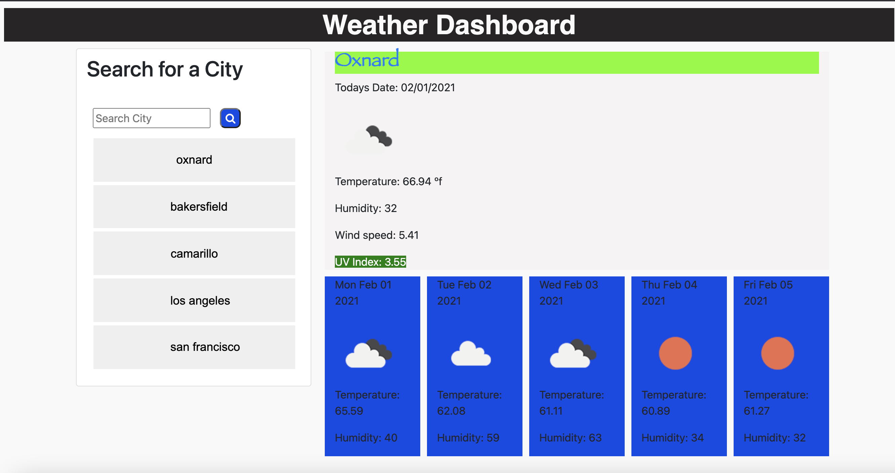

# Weather Dashboard

## Description

##### A weather application that allows you to select your city and retrieve the weather data accurate to the weather bradcast, it is an application to give you a heads up on the current weather and the following weather for the next couple days describing the climate and giving you an exact detail of the days broadcast.

# Built with:
* HTML
* CSS
* Javascript
* Jquery
* Server side APIs

##### https://alexreveles.github.io/weather-dashboard/

##### https://github.com/alexreveles/weather-dashboard

